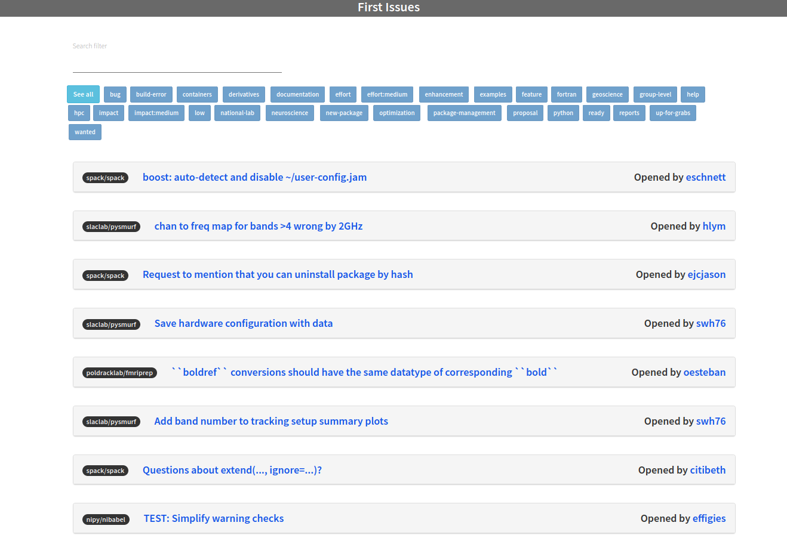

# Good First Issues



A GitHub action to generate a web interface with an updated set of issues. This means that:

 - the interface is created under docs/
 - issues are populated in docs/_issues
 - the site is served via Jekyll

This means that you can use the action in your workflows too,
and choose how often / when to run it, and how to update your GitHub pages.
Continue reading to learn more.

## Inputs

### `repos-file`

**Optional** The path to the repos.txt (or otherwise named) file. 
Defaults to repos.txt in the root of the repository.
The file should include a single list
of repository URLS, and (optionally) one or more comma separated tags:

```
https://github.com/spack/spack hpc,package-management
https://github.com/singularityhub/sregistry containers,singularity
```

### `label`

**optional** By default, the repository will filter down to issues labeled with "good first issue".
However, you can change this by setting this variable to something else.


## Example usage

```yaml
    steps:
    - name: Checkout Code
      uses: actions/checkout@v2
    - name: Generate First Issues
      uses: rseng/good-first-issues@v1.0.2
      with:
        repos-file: '.github/repos.txt'
        token: ${{ secrets.GITHUB_TOKEN }}
```

You only need to define repos-file if you change the path (note that the above is changed from .github/repos.txt). It's
highly recommended that you don't use master branch, but instead a version release or commit (as shown above).
Here is how you might update the label used:

```yaml
    steps:
    - name: Checkout Code
      uses: actions/checkout@v2
    - name: Generate First Issues
      uses: rseng/good-first-issues@v1.0.2
      with:
        label: 'bug'
        token: ${{ secrets.GITHUB_TOKEN }}
```

## Examples

 - [awesome-rseng](https://github.com/rseng/awesome-rseng/blob/master/.github/workflows/generate-first-issues.yml) to generate first issues from the awesome-rseng repository, with repos listed in [.github/repos.txt](https://github.com/rseng/awesome-rseng/blob/master/.github/repos.txt)

## Questions

## How do I customize the interface?

The interface will always be generated in the docs subfolder, so
if you haven't created it there yet, the action will generate
it the first time around. It's up to you to add all or a subset of
files in docs/* or docs/_issues after the content is generated.
For example, you could add both docs and _issues
in a next step that will commit to an existing or new branch:

```
git add docs/*
git add docs/_issues/*
```

This means that after the original docs is added and merged,
you should be able to customize or otherwise update the template
to your liking. The folder won't be edited if it already exists
beyond the _issues folder.

Do you have an example? Please contribute by opening an issue or a pull request!
